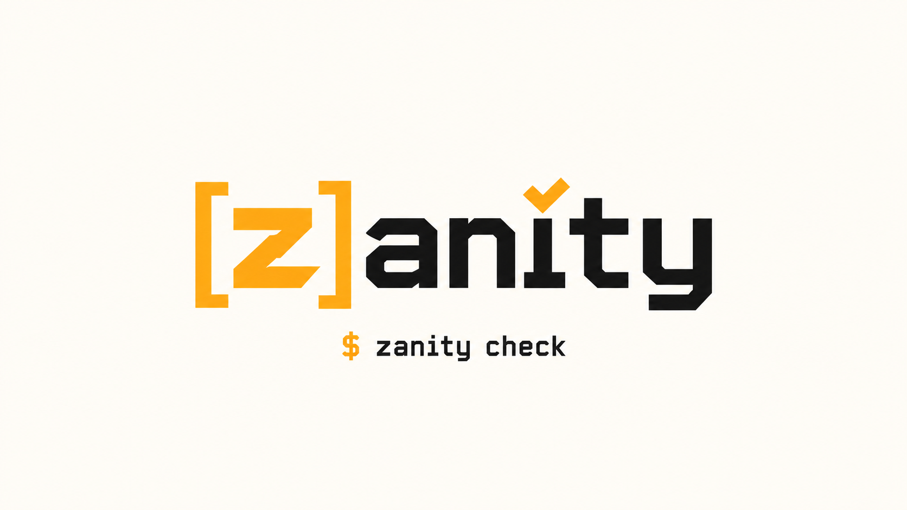

<p align="center"></p>

# zanity

Fast, deterministic sanity checks for code written by people and agents.

zanity checks Python, Zig, Go, TypeScript, Rust and Java for the mistakes that make code unsafe, untestable or hard to follow: unbounded loops, functions with no assertions, tests that sleep or touch the network, error messages that don't say what to do, and dozens more. It parses each file once with [tree-sitter](https://tree-sitter.github.io) and runs every rule in a single pass, so checking a whole repository takes moments. It is one static binary with no runtime to install, and it never touches the network, unless you add `--infer` to have a language model judge what code structure can't, such as whether an error message misleads.

```console
$ zanity check src
src/billing.py  2 errors, 1 warning
  12:5  error    'charge' has 0 assertions that can catch a bug; it needs at least 2.  assertion-density
                 fix: Assert what 'charge' needs from 'amount' and what it guarantees before it returns.
  ...
zanity: 2 errors and 1 warning in 1 of 14 files
```

## Install

On macOS or Linux:

```sh
curl -fsSL https://raw.githubusercontent.com/benomahony/zanity/main/install.sh | sh
```

It downloads the binary for your machine from the [latest release](https://github.com/benomahony/zanity/releases/latest), checks it against the SHA-256 GitHub lists for the release, and puts it in `~/.local/bin`, telling you if that isn't on your `PATH` yet. `ZANITY_VERSION=0.1.0` installs a particular release; `ZANITY_INSTALL_DIR` puts it somewhere else.

On Windows, in PowerShell:

```powershell
New-Item -ItemType Directory -Force "$HOME\bin" | Out-Null
Invoke-WebRequest -OutFile "$HOME\bin\zanity.exe" "https://github.com/benomahony/zanity/releases/latest/download/zanity-windows-x86_64.exe"
```

If you use [mise](https://mise.jdx.dev), `mise use -g github:benomahony/zanity` installs and updates it, as does [eget](https://github.com/zyedidia/eget) with `eget benomahony/zanity`. Or download `zanity-<os>-<arch>` from the release page yourself: it is a single file with nothing else to install, and the Linux builds are static, so they run on any distribution.

### From source

Building needs [Zig](https://ziglang.org/download/) at the version in `build.zig.zon`'s `minimum_zig_version`, currently a 0.17.0 nightly. Every grammar and library is vendored or fetched by the build.

```sh
git clone https://github.com/benomahony/zanity
cd zanity
zig build -Doptimize=ReleaseSafe
./zig-out/bin/zanity --version
```

## Getting started in a project

Run it from the root of your repository:

```sh
zanity check .
```

It checks every file in a language it knows, skipping whatever `.gitignore` ignores, dot directories and build output. Each finding says what is wrong and how to fix it. Many can be fixed for you:

```sh
zanity check . --fix
```

`--fix` makes only changes that can't alter what the code does, such as moving a declaration into the block that uses it or adding a message to an assertion. Where only a person knows something, like why an assertion must hold, it leaves a `TODO` comment for you to fill in.

Then write a `zanity.toml` to say what zanity should check:

```sh
zanity init
```

It writes every setting with notes on what it does, lists every rule with its severity and how to fix what it finds, turns on `rules = ["all"]`, and excludes the vendored and fixture directories it finds, such as `vendor/` and `tests/fixtures/`. Delete or change what you don't need; `--force` replaces an existing file.

Once `zanity check .` is clean, keep it that way with `--strict`, which fails on warnings as well as errors. That is what a pre-commit hook or CI should run.

When the deterministic checks pass, try `--infer` to have a language model judge your error messages too; see [Judging error messages with `--infer`](#judging-error-messages-with---infer).

### Pre-commit

With [pre-commit](https://pre-commit.com), add this to `.pre-commit-config.yaml` (zanity must be installed and on your `PATH`):

```yaml
repos:
  - repo: https://github.com/benomahony/zanity
    rev: v0.1.0  # the release you installed
    hooks:
      - id: zanity         # zanity check . --strict
      # - id: zanity-fix   # applies fixes first, then fails on anything left
```

The hook checks the whole repository rather than only the staged files, because some rules compare files with each other (a name spelled two ways in two files, a function calling itself through another file).

Without pre-commit, a plain git hook does the same:

```sh
printf '#!/bin/sh\nexec zanity check . --strict\n' > .git/hooks/pre-commit
chmod +x .git/hooks/pre-commit
```

### GitHub Actions

```yaml
jobs:
  zanity:
    runs-on: ubuntu-latest
    steps:
      - uses: actions/checkout@v5
      - uses: benomahony/zanity@v0.1.0
        # with:
        #   version: 0.1.0               # default: the latest release
        #   args: check src --strict     # default: check . --strict
```

The action downloads the release binary for the runner and fails the job on any finding. To include `--infer`, store your TypeSafe key as a repository secret and pass it in:

```yaml
      - uses: benomahony/zanity@v0.1.0
        with:
          args: check . --strict --infer
        env:
          TYPESAFE_API_KEY: ${{ secrets.TYPESAFE_API_KEY }}
```

## Usage

```sh
zanity init                                   # write a zanity.toml with every setting explained
zanity check                                  # check the current directory
zanity check src tests                        # check some paths
zanity check . --rules recursion,long-function   # run only these rules
zanity check . --rules all                    # every rule, including those off by default
zanity check . --strict                       # exit 1 on warnings too
zanity check . --fix                          # apply the fixes zanity can make, then report the rest
zanity check . --json                         # a JSON array, one object per finding
zanity check . --plain                        # stable key=value lines for scripts
zanity check . --infer                        # also have a language model judge error messages
zanity help check                             # every option
```

`check` exits 0 when nothing fired, 1 when an error-level rule fired (or any rule, with `--strict`), and 2 on a usage error such as a mistake in `zanity.toml`. Findings go to stdout and the one-line summary to stderr, so output can be piped cleanly. On a terminal the report is grouped by file and ends with two tables: the files with the most errors, and the rules that fired most. A progress line shows how far a long run has got; `-q` hides it, and it never appears in piped output. `--no-color` or `NO_COLOR` turns colour off.

### Judging error messages with `--infer`

Whether an error message is vague, cryptic or unhelpful can often be decided from the code: a message that shows none of the values its condition reads is vague. zanity checks that deterministically on every run. What code structure can't settle, such as whether a message describes a different failure from the one that happened, `--infer` asks of a language model through the [TypeSafe API](https://docs.typesafe.ai/api), after every deterministic check has run.

```sh
export TYPESAFE_API_KEY=...   # from your TypeSafe account
zanity check . --infer
```

| Rule | Asks whether a function |
|---|---|
| `vague-error` | has an error message too vague to find the problem: it doesn't name the input or value that failed, or what was expected |
| `cryptic-error` | has an error message that isn't in plain language: a code, an internal name or jargon |
| `unconstructive-error` | has an error message that says what failed but not what to do about it |
| `misleading-error` | has an error message that describes a different failure from the one that happened (*off* by default; `rules = ["all"]` includes it) |

A finding is reported when the model is at least 80% sure, and says how sure it was. `threshold` under `[infer]` in `zanity.toml` changes that: `threshold = 0.9` reports only what it is at least 90% sure of, and a lower value reports more.

**What is sent:** the source of each function that raises, returns or logs an error, and only the questions no deterministic check already answered. Nothing else leaves your machine, and without `--infer` nothing does at all.

**Cost and speed:** answers are cached in a SQLite file, `~/.cache/zanity/zanity.db` (or wherever `ZANITY_STORE` points), keyed by the function's source, so unchanged code is never asked about twice and a second run is instant. A progress line shows how many functions are answered and how long the rest will take. `[infer] concurrency` in `zanity.toml` sets how many requests run at once (default 8, up to 64); `TYPESAFE_BASE_URL` points at a different TypeSafe endpoint.

## Configuration

zanity reads the nearest `zanity.toml` at or above the directory it runs in, stopping at the repository root. For completion, hover docs and errors as you type, make this its first line; editors with a TOML language server, such as VS Code's Even Better TOML, pick it up:

```toml
#:schema https://raw.githubusercontent.com/benomahony/zanity/main/zanity.schema.json
```

Everything is optional:

```toml
# Run only these rules; "all" is every rule, including those off by default.
# Leave it out to run the defaults.
rules = ["recursion", "unbounded-loop", "long-function"]

# Or keep the defaults but switch some off.
disable = ["duplicate-name"]

# Paths to skip, in .gitignore syntax, relative to this file.
exclude = ["vendor/", "tests/fixtures/**"]

[infer]
# Requests sent to TypeSafe at once (1 to 64, default 8).
concurrency = 16
# How sure TypeSafe must be for a judgement to become a finding (above 0 up to 1, default 0.8).
threshold = 0.9

# Rules that don't report in some files. The pattern is .gitignore syntax, relative to this
# file; add a section per pattern.
[paths."tests/e2e/"]
disable = ["process-in-test", "network-in-test"]
```

`--rules` on the command line overrides `rules` and `disable`. A mistake in the file stops the run with exit code 2 and names the line and what to write instead, for example `zanity.toml:1: 'recursions' isn't a rule; ...`.

## Suppressing a finding

A comment on the line of the finding silences it, in any language:

```python
value = eval(text)  # zanity: ignore[forbidden-call]
```

`zanity: ignore` with no list silences every rule on that line. A rule can be named by its name or by its code, such as `NASA01-A`.

## Languages

| Language | Extensions |
|---|---|
| Python | `.py` `.pyi` |
| Zig | `.zig` |
| Go | `.go` |
| TypeScript | `.ts` `.mts` `.cts` |
| Rust | `.rs` |
| Java | `.java` |

Every rule runs on every language where it means something; `dynamic-allocation`, for example, only applies where memory is managed by hand.

## Rules

Rules marked *off* run only with `--rules all`, `rules = ["all"]`, or when named.

**NASA's Power of Ten**

| Rule | Severity | Flags |
|---|---|---|
| `recursion` | warning | a function that calls itself, directly or through a cycle of calls across files |
| `unbounded-loop` | warning | a loop with no bound, such as `while True` or `for {}` |
| `dynamic-allocation` | error | allocation after initialization, in Zig and Rust |
| `long-function` | warning | a function with 60 or more lines of code, not counting blank and comment lines |
| `wide-scope` | warning | a local declared in a wider block than the only one that uses it |
| `assertion-density` | error | a function with fewer than two assertions that can catch a bug |
| `assertion-message` | warning | an assertion with no message |
| `assertion-side-effect` | error | an assertion that assigns or calls something that changes state |
| `forbidden-call` | warning | `eval`, `exec` and other calls that run code no one can review |
| `restated-type`, `constant-assertion`, `redundant-null-check`, `conversion-assertion`, `guaranteed-length` | *off* | assertions that cannot fail, which do not count towards density |

**Structure**

| Rule | Severity | Flags |
|---|---|---|
| `long-parameter-list` | warning | more than four parameters |
| `passthrough-wrapper` | warning | a function whose whole body forwards to another call |
| `swallowed-error` | warning | an error handler that does nothing |
| `empty-block` | warning | an empty block where code was expected |
| `deep-nesting` | warning | code nested too deep to follow |
| `complex-function` | warning | a function or test with too many paths through it |
| `long-file` | warning | a file too long to hold in mind |

**Tests**

| Rule | Severity | Flags |
|---|---|---|
| `long-test` | warning | a test with 50 or more lines of code, not counting blank and comment lines |
| `eager-test` | warning | a test that makes more than 10 checks, counting assertions and test-framework checks such as `expect` and `assertEquals` |
| `sleep-in-test` | warning | a test that waits on the clock |
| `polling-loop` | warning | a loop in a test that polls with a sleep |
| `nondeterministic-test` | warning | randomness or the current time in a test |
| `test-double` | warning | a mock or stub that replaces real behaviour |
| `shared-state-in-test` | warning | a test that changes process-wide state: an environment variable, the working directory, the import path, a global default or a `global` |
| `filesystem-in-test` | warning | a test that reads or changes real files outside its own temporary directory |
| `network-in-test` | warning | a test that makes a real network request or connection |
| `database-in-test` | warning | a test that connects to a real database; in-memory databases are fine |
| `unmanaged-temp-in-test` | warning | a test that makes temporary files its framework doesn't clean up |
| `process-in-test` | warning | a test that starts a real process |

**Names**

| Rule | Severity | Flags |
|---|---|---|
| `name-drift` | warning | one concept spelled several ways, such as `order_total` and `total_order` |
| `duplicate-name` | warning | the same name defined more than once in one language |

**Error messages**

| Rule | Severity | Flags |
|---|---|---|
| `vague-error` | warning | a message too vague to find the problem |
| `cryptic-error` | warning | a message that is only a code or an internal name |
| `unconstructive-error` | warning | a message that does not say how to fix the problem |
| `misleading-error` | *off* | a message that describes a different failure; needs `--infer` |

**Hazards** (each traces to an entry in the engineering error catalogue in `catalogue/`)

`constant-condition`, `float-equality`, `discarded-comparison`, `unreachable-code`, `generic-catch`, `generic-throw`, `debug-leftover`, `hardcoded-secret`, `return-in-finally`, `identity-comparison`, `precedence-trap`, `switch-fallthrough`, `missing-default`, `no-effect-statement`, `tls-verification-disabled`, `weak-hash`, `unsafe-deserialization`, `shell-command`, `sql-built-from-strings`, `secret-in-log`, `wall-clock-duration` and `unawaited-call`.

`parse-error` reports a file tree-sitter could not fully parse; the other rules still run on what it recovered.

## Contributing

### How it works

```
file ──► tree-sitter parse ──► one query per language ──► capture index ──► single walk ──► findings
                                (tags, locals, textobjects,                   │
                                 zanity.scm)                                 └─► facts ──► cross-file checks
                                                                                         (call graph, names)
```

- **Languages are data.** Each language in `languages/<name>/` is a vendored grammar, the upstream `tags.scm`, nvim-treesitter's `locals.scm` and `textobjects.scm`, and a `zanity.scm` that adds the captures they lack. Library knowledge, such as which calls sleep, mock or allocate, lives in `languages/tables.zon`, one entry per ecosystem. `src/architecture_test.zig` fails the build if any Zig source names a language or a grammar node kind.
- **Rules are written against captures**, a fixed vocabulary such as `@function.name`, `@call.receiver`, `@loop.condition` and `@assertion.message`. The walk keeps a stack of open functions, calls, loops and assertions; roles attach to the construct that encloses them and each construct's checks run when it closes.
- **Cross-file checks run once after all files**, over facts the walk collects: definitions for the naming rules, and functions and calls for the call graph.
- **Memory is fixed.** Every buffer is allocated at startup from the limits in `src/memory.zig`; tree-sitter itself allocates from bump pools, one reset after each file. Exceeding a limit is a clear error naming the limit, not a crash.

### Adding a language

No Zig code changes. Add:

1. the grammar's `parser.c` (and `scanner.c`) under `languages/<name>/grammar/`, with its licence and revision;
2. its query files under `languages/<name>/queries/`, starting from upstream `tags.scm`, `locals.scm` and `textobjects.scm`, then a `zanity.scm` for the rest;
3. an entry in `languages/manifest.zon` and, for a new ecosystem, in `languages/tables.zon`;
4. golden cases under `tests/golden/`.

`zig build test` then lists every capture the language still needs for each rule. Supply it, or declare the rule not applicable to the language.

### The config schema

`zanity.schema.json` is written from the rules and limits in the code by `zig build schema`; a test fails when it is out of date, so run that after adding a rule or a setting.

### Testing

```sh
zig build test              # unit, golden, architecture, catalogue and self-check tests
zig build test --fuzz=100K  # fuzz the checker with arbitrary bytes in every language
```

Golden cases in `tests/golden/` run through the real binary and compare where each finding lands, its rule, its severity and the exit code, not the wording. The self-check runs zanity over its own source with every rule and fails on any finding.

### Releasing

Every commit that passes CI on `main` is released automatically, one patch version up from the latest release: the workflow builds every platform with `zig build release -Dversion=<version>` and publishes the binaries as a GitHub release, tagging that commit. To raise the minor or major version instead, run the release workflow by hand:

```sh
gh workflow run release -f bump=minor   # or bump=major
```

`zig build release` works locally too; the binaries land in `zig-out/release/` and report themselves as `zanity dev` unless you pass `-Dversion`.

## Licence

zanity is MIT licensed; see `LICENSE`. Grammars and nvim-treesitter queries keep their own licences, alongside them in `languages/`. The CWE data in `catalogue/` is © The MITRE Corporation.
